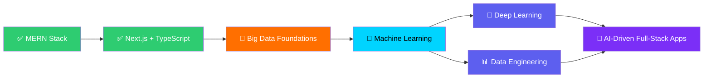

<!-- ====================== HEADER / HERO ====================== -->
<div align="center">

<!-- Full-width animated gradient banner -->


<!-- Animated greeting -->

&nbsp;<b>Hi there! I turn ideas into reliable, well-typed web apps.</b>

<br><br>

<!-- Typing animation -->
<a href="https://github.com/Artreeus">
  
</a>

<br>

<!-- Stat badges — static, so they never hit the GitHub API and never render "invalid". -->

<a href="https://github.com/Artreeus?tab=followers">
  
</a>

<br>

<!-- Quick links -->
<a href="https://hasan0481.netlify.app" target="_blank">
  
</a>
<a href="https://www.linkedin.com/in/artreeuss" target="_blank">
  
</a>
<a href="mailto:ratulhasan048@gmail.com" target="_blank">
  
</a>
<a href="https://github.com/Artreeus?tab=repositories">
  
</a>

</div>

---

<!-- ====================== ABOUT ====================== -->
##  About Me


```typescript
const mahamudul: Developer = {
  name:        "Mahamudul Hasan Ratul",
  location:    "Dhaka, Bangladesh 🇧🇩",
  role:        "Full-Stack Developer",
  affiliation: "BdREN — Bangladesh Research & Education Network",
  education:   "BSc in CSE @ Bangladesh University",
  stack:       ["TypeScript", "React", "Next.js", "Node.js", "MongoDB"],
  focus:       ["Big Data", "Machine Learning", "AI"],
  principle:   "Clean, maintainable code is a love letter to the next developer.",
};
```

**What I focus on**

- 🧱 &nbsp;Building production-grade full-stack apps across the MERN stack and Next.js
- ✍️ &nbsp;Writing clean, well-typed, maintainable code with a strong eye on structure
- 📊 &nbsp;Exploring Big Data, Machine Learning, and AI as the next step in my work
- 🤝 &nbsp;Open to collaboration and full-time / freelance opportunities

<br clear="right"/>

---

<!-- ====================== EXPERIENCE ====================== -->
## 💼 Experience

<table>
  <tr>
    <td width="50%" valign="top">
      <h3>🚀 Full-Stack Developer</h3>
      <p><b>BdREN — Bangladesh Research & Education Network</b>
        &nbsp;
      </p>
      <p>Building scalable, well-typed web applications that support Bangladesh's national research and education network. Working across the full MERN + Next.js stack to deliver internal tools and public-facing platforms with a strong focus on architecture, performance, and maintainability.</p>
      <p>
        
        
        
        
      </p>
    </td>
    <td width="50%" valign="top">
      <h3>💻 Freelance Full-Stack Developer</h3>
      <p><b>Self-Employed · Remote</b>
        &nbsp;
      </p>
      <p>Delivering end-to-end web solutions for clients — from polished landing pages to production-grade full-stack applications. Specializing in clean, component-driven architectures, type-safe APIs, and deployment pipelines that ship fast and stay maintainable.</p>
      <p>
        
        
        
        
      </p>
    </td>
  </tr>
</table>

<div align="center">
  
  
  
</div>

---

<!-- ====================== CURRENTLY BUILDING ====================== -->
## 🔨 Currently Building

<div align="center">


</div>

<table>
  <tr>
    <td width="50%" valign="top">
      <h3>🤖 ML Foundations Lab</h3>
      <p>Hands-on experiments with TensorFlow and PyTorch — building foundational skills in computer vision, NLP, and predictive modeling. Working through Kaggle datasets and reimplementing classic ML papers from scratch to develop real intuition, not just API familiarity.</p>
      <p>
        
        
        
        
      </p>
    </td>
    <td width="50%" valign="top">
      <h3>📊 Big Data Pipelines</h3>
      <p>Exploring large-scale data processing with modern tools — building ETL pipelines, analytics dashboards, and streaming workflows. Connecting my full-stack background with data engineering to ship end-to-end data products that are actually useful in production.</p>
      <p>
        
        
        
        
      </p>
    </td>
  </tr>
  <tr>
    <td width="50%" valign="top">
      <h3>🏗️ Production-Grade MERN Templates</h3>
      <p>Iterating on a personal starter kit for MERN + Next.js apps — typed end-to-end, with auth, RBAC, testing, and CI/CD pre-wired. The goal: ship new ideas in hours, not weeks, without sacrificing long-term maintainability.</p>
      <p>
        
        
        
      </p>
    </td>
    <td width="50%" valign="top">
      <h3>✍️ Technical Writing</h3>
      <p>Documenting what I learn — from TypeScript patterns to ML fundamentals — in clear, beginner-friendly articles. Teaching is the fastest way to find the gaps in your own understanding, and writing forces clarity that casual reading never will.</p>
      <p>
        
        
        
      </p>
    </td>
  </tr>
</table>

---

<!-- ====================== TECH STACK ====================== -->
## 🧰 Tech Stack

<div align="center">

<table>
  <tr>
    <td align="right" width="170"><b>💻 &nbsp;Languages</b></td>
    <td></td>
  </tr>
  <tr>
    <td align="right"><b>🎨 &nbsp;Frontend</b></td>
    <td></td>
  </tr>
  <tr>
    <td align="right"><b>⚙️ &nbsp;Backend</b></td>
    <td></td>
  </tr>
  <tr>
    <td align="right"><b>🗄️ &nbsp;Database</b></td>
    <td></td>
  </tr>
  <tr>
    <td align="right"><b>🛠️ &nbsp;DevOps & Tools</b></td>
    <td></td>
  </tr>
  <tr>
    <td align="right"><b>🤖 &nbsp;Exploring</b></td>
    <td></td>
  </tr>
</table>

</div>

---

<!-- ====================== FEATURED PROJECTS ====================== -->
## 🚀 Featured Projects

<table>
  <tr>
    <td width="33%" valign="top">
      <h3>🗂️ Family Memory Vault</h3>
      <p>A full-stack platform for storing, organizing, and revisiting a family's most important memories — built with a typed, component-driven architecture.</p>
      <p>
        
        
      </p>
      <p><a href="https://github.com/Artreeus/Family_Memory_vault"><b>→ View Code</b></a></p>
    </td>
    <td width="33%" valign="top">
      <h3>💬 RevuLoop</h3>
      <p>A review platform where users submit and browse honest reviews, with a clean, responsive interface and a structured front-end codebase.</p>
      <p>
        
        
      </p>
      <p><a href="https://github.com/Artreeus/RevuLoop_frontend"><b>→ View Code</b></a></p>
    </td>
    <td width="33%" valign="top">
      <h3>☁️ Fredocloud</h3>
      <p>A full-stack engineering assignment implementing cloud-style features end to end, covering both the client and server sides.</p>
      <p>
        
        
      </p>
      <p><a href="https://github.com/Artreeus/Fredocloud"><b>→ View Code</b></a></p>
    </td>
  </tr>
</table>

<div align="center">
  <a href="https://github.com/Artreeus?tab=repositories">
    
  </a>
  <a href="https://hasan0481.netlify.app">
    
  </a>
</div>

---

<!-- ====================== 2025 GOALS ====================== -->
## 🎯 2025 Goals

<div align="center">

<table>
  <tr>
    <th align="left" width="60">🎯</th>
    <th align="left">Goal</th>
    <th align="center" width="220">Progress</th>
  </tr>
  <tr>
    <td>🤖</td>
    <td>Ship my first ML project on Kaggle</td>
    <td align="center"></td>
  </tr>
  <tr>
    <td>📚</td>
    <td>Complete a Big Data specialization end-to-end</td>
    <td align="center"></td>
  </tr>
  <tr>
    <td>🚀</td>
    <td>Contribute to 5 open-source repositories</td>
    <td align="center"></td>
  </tr>
  <tr>
    <td>💼</td>
    <td>Land a senior-level full-stack role</td>
    <td align="center"></td>
  </tr>
  <tr>
    <td>📝</td>
    <td>Publish 10 technical blog posts</td>
    <td align="center"></td>
  </tr>
  <tr>
    <td>🎓</td>
    <td>Graduate BSc in CSE with distinction</td>
    <td align="center"></td>
  </tr>
</table>

</div>

---

<!-- ====================== LEARNING ROADMAP ====================== -->
## 🗺️ Learning Roadmap

<div align="center">



</div>

<table>
  <tr>
    <td width="33%" valign="top" align="center">
      <h3>✅ Mastered</h3>
      <p>MERN Stack · Next.js · TypeScript<br>REST & GraphQL APIs · Component Architecture</p>
      
    </td>
    <td width="33%" valign="top" align="center">
      <h3>🔴 In Progress</h3>
      <p>Big Data · Distributed Systems<br>ETL Pipelines · Apache Spark</p>
      
    </td>
    <td width="33%" valign="top" align="center">
      <h3>🚀 Next Up</h3>
      <p>Deep Learning · MLOps<br>Production AI Systems · LLM Integration</p>
      
    </td>
  </tr>
</table>

---

<!-- ====================== EDUCATION ====================== -->
## 🎓 Education

<table>
  <tr>
    <td width="50%" valign="top">
      <h3>🏛️ BSc in Computer Science & Engineering</h3>
      <p><b>Bangladesh University</b>
        &nbsp;
      </p>
      <p>📚 Coursework: Big Data, Machine Learning, Artificial Intelligence</p>
    </td>
    <td width="50%" valign="top">
      <h3>🎓 Diploma in Computer Science & Technology</h3>
      <p><b>Dhaka Polytechnic Institute</b>
        &nbsp;
        
      </p>
      <p>📚 Coursework: Web Development, Database Management, Software Engineering</p>
    </td>
  </tr>
</table>

---

<!-- ====================== CERTIFICATIONS & BADGES ====================== -->
## 🏆 Certifications & Recognition

<table>
  <tr>
    <th>🎖️ Certification</th>
    <th>🏢 Issuer</th>
    <th>📅 Year</th>
  </tr>
  <tr>
    <td>Complete Web Development</td>
    <td>Programming Hero</td>
    <td align="center"></td>
  </tr>
  <tr>
    <td>Python Mastery</td>
    <td>HackerRank</td>
    <td align="center"></td>
  </tr>
</table>

**GitHub badges earned**
&nbsp;


---

<!-- ====================== DEV SETUP ====================== -->
## 💻 Development Setup

<div align="center">

<table>
  <tr>
    <td align="center" width="20%">
      <br>
      <b>Editor</b><br>VS Code
    </td>
    <td align="center" width="20%">
      <br>
      <b>OS</b><br>Ubuntu / Windows
    </td>
    <td align="center" width="20%">
      <br>
      <b>Version Control</b><br>Git + GitHub
    </td>
    <td align="center" width="20%">
      <br>
      <b>Deployment</b><br>Vercel + Netlify
    </td>
    <td align="center" width="20%">
      <br>
      <b>Containers</b><br>Docker
    </td>
  </tr>
  <tr>
    <td align="center">
      <br>
      <b>API Testing</b><br>Postman
    </td>
    <td align="center">
      <br>
      <b>Design</b><br>Figma
    </td>
    <td align="center">
      <br>
      <b>Package Mgr</b><br>npm + pnpm
    </td>
    <td align="center">
      <br>
      <b>CI / CD</b><br>GitHub Actions
    </td>
    <td align="center">
      <br>
      <b>Notebooks</b><br>Jupyter
    </td>
  </tr>
</table>

<details>
<summary><b>🔧 My VS Code Extensions</b></summary>
<br>

| Category | Extensions |
|----------|-----------|
| 🧠 Intelligence | ESLint · Prettier · TypeScript Hero · Path Intellisense |
| 🎨 UI / Themes | Material Icon Theme · One Dark Pro · GitLens |
| ⚡ Productivity | Turbo Console Log · Error Lens · Thunder Client |
| 🤖 AI | GitHub Copilot · Codeium · IntelliCode |
| 🐛 Debugging | Docker · MongoDB · Prisma · Database Client |

</details>

</div>

---

<!-- ====================== GITHUB STATS ====================== -->
## 📊 GitHub Analytics

<div align="center">


<br><br>


<br><br>


</div>

---

<!-- ====================== TROPHY CASE ====================== -->
## 🏆 Trophy Case

<div align="center">

<!-- Using the algolia theme on the public trophy endpoint. If this host rate-limits
     intermittently, swap to a volunteer mirror such as:
       https://github-profile-trophy-fork-two.vercel.app
       https://github-profile-trophy-winning.vercel.app
-->
<a href="https://github.com/ryo-ma/github-profile-trophy">
  
</a>

</div>

---

<!-- ====================== DEV QUOTE ====================== -->
## 💭 Dev Quote of the Day

<div align="center">


</div>

---

<!-- ====================== FUN FACTS ====================== -->
## 🌟 Fun Facts

<div align="center">

<table>
  <tr>
    <td align="center" width="50%">
      <h3>📊 By the Numbers</h3>
      <table align="center">
        <tr><td align="right">☕ Coffee / week</td><td><b>25+ cups</b></td></tr>
        <tr><td align="right">🕐 Hours coding / week</td><td><b>40+ hrs</b></td></tr>
        <tr><td align="right">🐛 Bugs squashed</td><td><b>Lost count 🤷</b></td></tr>
        <tr><td align="right">💡 Side project ideas</td><td><b>Always brewing</b></td></tr>
        <tr><td align="right">🎯 Commits this year</td><td><b>1,000+</b></td></tr>
        <tr><td align="right">🌍 Time zone</td><td><b>GMT+6 (Dhaka)</b></td></tr>
      </table>
    </td>
    <td align="center" width="50%">
      <h3>🎲 About Me</h3>
      <p align="left">
        🎯 I debug with <code>console.log</code> first, devtools second<br>
        📚 I read documentation like it's a novel<br>
        ☕ My best code is written after midnight<br>
        🎵 Lo-fi beats + coding = pure flow state<br>
        🧩 I treat architecture like solving puzzles<br>
        🚀 I'm happiest shipping something — anything<br>
        🤝 Pair programming > solo heroics
      </p>
    </td>
  </tr>
</table>

</div>

---

<!-- ====================== WHEN NOT CODING ====================== -->
## 🎮 When I'm Not Coding

<div align="center">

<table>
  <tr>
    <td align="center" width="25%">
      <br>
      <b>Tech blogs &<br>sci-fi novels</b>
    </td>
    <td align="center" width="25%">
      <br>
      <b>Strategy &<br>indie titles</b>
    </td>
    <td align="center" width="25%">
      <br>
      <b>Exploring Dhaka's<br>best cafés</b>
    </td>
    <td align="center" width="25%">
      <br>
      <b>Long walks &<br>photography</b>
    </td>
  </tr>
</table>

</div>

---

<!-- ====================== SUPPORT ====================== -->
## ☕ Support My Work

<div align="center">

If my projects or code have helped you, consider supporting me — every cup of coffee keeps the commits flowing!

<br>

<a href="https://www.buymeacoffee.com/Artreeus" target="_blank">
  
</a>
<a href="https://github.com/sponsors/Artreeus" target="_blank">
  
</a>

<br><br>

<details>
<summary><b>🌟 Star History</b></summary>
<br>

<a href="https://star-history.com/#Artreeus&Date">
  
</a>

</details>

</div>

---

<!-- ====================== CONNECT ====================== -->
## 📫 Connect with Me

<p align="center">
  <a href="https://hasan0481.netlify.app" target="_blank"></a>
  <a href="https://www.linkedin.com/in/artreeuss" target="_blank"></a>
  <a href="https://github.com/Artreeus" target="_blank"></a>
  <a href="https://www.facebook.com/Artreeuss" target="_blank"></a>
  <a href="https://www.instagram.com/artreeeus" target="_blank"></a>
  <a href="mailto:ratulhasan048@gmail.com" target="_blank"></a>
</p>

<div align="center">

<table>
  <tr>
    <td align="center">
      
      
      
    </td>
  </tr>
</table>

</div>

---

<!-- ====================== PHILOSOPHY ====================== -->
<div align="center">

### 💭 Code Philosophy

> *"Continuous learning and improvement are what turn a developer into a great engineer.*
> *Every line of code is a chance to solve a problem and build something meaningful."*

</div>

---

<!-- ====================== SNAKE ANIMATION ====================== -->
<div align="center">

### 🐍 Watch the snake eat my contributions

<picture>
  <source media="(prefers-color-scheme: dark)" srcset="https://raw.githubusercontent.com/Artreeus/Artreeus/output/github-snake-dark.svg" />
  <source media="(prefers-color-scheme: light)" srcset="https://raw.githubusercontent.com/Artreeus/Artreeus/output/github-snake.svg" />
  
</picture>

</div>

<!-- ====================== FOOTER ====================== -->
<div align="center">

<br>

⭐️ Crafted with care by <a href="https://github.com/Artreeus"><b>Mahamudul Hasan</b></a><br>
If my work is useful to you, a follow or a star is always appreciated.

<br>

<i>Made with 💜 and plenty of ☕ in Dhaka, Bangladesh 🇧🇩</i>


</div>
